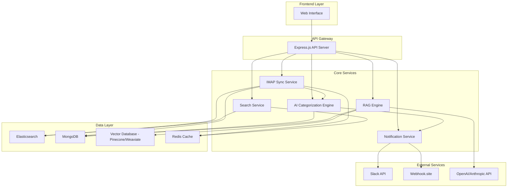

# Email Aggregator System Design

## Overview

The Email Aggregator System is a microservices-based application that provides real-time email synchronization, AI-powered categorization, and intelligent reply suggestions. The system follows a modular architecture with clear separation of concerns, enabling scalability and maintainability.

## Architecture

### High-Level Architecture



### Service Architecture Pattern

The system follows a microservices architecture with the following principles:
- **Event-driven communication** between services using Redis pub/sub
- **Database per service** pattern for data isolation
- **API Gateway** pattern for unified client interface
- **Circuit breaker** pattern for external service resilience

## Components and Interfaces

### 1. IMAP Sync Service

**Responsibilities:**
- Establish and maintain persistent IMAP connections
- Handle real-time email synchronization using IDLE mode
- Manage connection pooling and reconnection logic
- Emit events for new emails

**Key Interfaces:**
```typescript
interface IMAPSyncService {
  addAccount(config: IMAPConfig): Promise<void>
  removeAccount(accountId: string): Promise<void>
  getConnectionStatus(accountId: string): ConnectionStatus
  syncHistoricalEmails(accountId: string, days: number): Promise<void>
}

interface IMAPConfig {
  id: string
  host: string
  port: number
  username: string
  password: string
  tls: boolean
}

interface EmailEvent {
  type: 'NEW_EMAIL' | 'EMAIL_UPDATED' | 'EMAIL_DELETED'
  accountId: string
  email: EmailDocument
  timestamp: Date
}
```

**Implementation Details:**
- Uses `node-imap` library with custom connection pooling
- Implements exponential backoff for reconnection attempts
- Maintains separate worker processes for each IMAP account
- Uses Redis for coordination between workers

### 2. AI Categorization Engine

**Responsibilities:**
- Process incoming emails for categorization
- Apply machine learning models for classification
- Handle batch processing for historical emails
- Maintain categorization accuracy metrics

**Key Interfaces:**
```typescript
interface AICategorization {
  categorizeEmail(email: EmailDocument): Promise<CategoryResult>
  batchCategorize(emails: EmailDocument[]): Promise<CategoryResult[]>
  updateModel(trainingData: TrainingData[]): Promise<void>
  getAccuracyMetrics(): Promise<AccuracyMetrics>
}

interface CategoryResult {
  category: 'Interested' | 'Meeting Booked' | 'Not Interested' | 'Spam' | 'Out of Office'
  confidence: number
  reasoning?: string
}
```

**Implementation Strategy:**
- Uses OpenAI GPT-4 for initial categorization with few-shot prompting
- Implements local fine-tuned model as fallback (using Hugging Face Transformers)
- Caches categorization results in Redis for performance
- Implements feedback loop for continuous model improvement

### 3. Search Service

**Responsibilities:**
- Index emails in Elasticsearch
- Provide search and filtering capabilities
- Manage index lifecycle and optimization
- Handle search analytics

**Key Interfaces:**
```typescript
interface SearchService {
  indexEmail(email: EmailDocument): Promise<void>
  searchEmails(query: SearchQuery): Promise<SearchResult>
  deleteEmail(emailId: string): Promise<void>
  getSearchSuggestions(partial: string): Promise<string[]>
}

interface SearchQuery {
  text?: string
  accountIds?: string[]
  folders?: string[]
  categories?: string[]
  dateRange?: DateRange
  pagination: Pagination
}
```

**Elasticsearch Schema:**
```json
{
  "mappings": {
    "properties": {
      "id": { "type": "keyword" },
      "accountId": { "type": "keyword" },
      "subject": { "type": "text", "analyzer": "standard" },
      "body": { "type": "text", "analyzer": "standard" },
      "from": { "type": "keyword" },
      "to": { "type": "keyword" },
      "folder": { "type": "keyword" },
      "category": { "type": "keyword" },
      "timestamp": { "type": "date" },
      "attachments": { "type": "nested" }
    }
  }
}
```

### 4. Notification Service

**Responsibilities:**
- Send Slack notifications for interested emails
- Trigger webhooks for external integrations
- Handle notification queuing and retry logic
- Manage notification preferences

**Key Interfaces:**
```typescript
interface NotificationService {
  sendSlackNotification(email: EmailDocument): Promise<void>
  triggerWebhook(email: EmailDocument, webhookUrl: string): Promise<void>
  queueNotification(notification: NotificationRequest): Promise<void>
  getNotificationHistory(accountId: string): Promise<NotificationHistory[]>
}
```

### 5. RAG Engine

**Responsibilities:**
- Store and retrieve contextual information
- Generate contextually appropriate reply suggestions
- Manage conversation history and context
- Handle vector similarity search

**Key Interfaces:**
```typescript
interface RAGEngine {
  storeContext(context: ContextDocument): Promise<void>
  generateReply(email: EmailDocument, context?: string): Promise<ReplyOptions>
  updateContext(contextId: string, updates: Partial<ContextDocument>): Promise<void>
  searchSimilarContext(query: string): Promise<ContextDocument[]>
}

interface ReplyOptions {
  suggestions: ReplySuggestion[]
  confidence: number
  contextUsed: string[]
}

interface ReplySuggestion {
  text: string
  tone: 'professional' | 'casual' | 'formal'
  confidence: number
}
```

## Data Models

### Core Email Document
```typescript
interface EmailDocument {
  id: string
  accountId: string
  messageId: string
  subject: string
  body: string
  htmlBody?: string
  from: EmailAddress
  to: EmailAddress[]
  cc?: EmailAddress[]
  bcc?: EmailAddress[]
  folder: string
  timestamp: Date
  category?: CategoryResult
  attachments: Attachment[]
  headers: Record<string, string>
  flags: string[]
  createdAt: Date
  updatedAt: Date
}

interface EmailAddress {
  name?: string
  address: string
}

interface Attachment {
  id: string
  filename: string
  contentType: string
  size: number
  contentId?: string
}
```

### Account Configuration
```typescript
interface AccountConfig {
  id: string
  userId: string
  name: string
  email: string
  imapConfig: IMAPConfig
  syncSettings: SyncSettings
  notificationSettings: NotificationSettings
  isActive: boolean
  lastSyncAt?: Date
  createdAt: Date
}

interface SyncSettings {
  syncHistoryDays: number
  folders: string[]
  excludeSpam: boolean
  autoCategorizationEnabled: boolean
}
```

## Error Handling

### Error Classification
1. **Transient Errors**: Network timeouts, temporary service unavailability
2. **Configuration Errors**: Invalid IMAP credentials, malformed settings
3. **Data Errors**: Corrupted email content, parsing failures
4. **External Service Errors**: AI API failures, Elasticsearch unavailability

### Error Handling Strategy
```typescript
interface ErrorHandler {
  handleIMAPError(error: IMAPError, accountId: string): Promise<void>
  handleAIError(error: AIError, email: EmailDocument): Promise<void>
  handleSearchError(error: SearchError, operation: string): Promise<void>
  handleNotificationError(error: NotificationError, notification: NotificationRequest): Promise<void>
}
```

**Implementation:**
- Exponential backoff with jitter for retries
- Circuit breaker pattern for external services
- Dead letter queues for failed operations
- Comprehensive logging with correlation IDs
- Health checks and monitoring endpoints

## Testing Strategy

### Unit Testing
- **Coverage Target**: 90% code coverage
- **Framework**: Jest with TypeScript support
- **Mocking**: Mock external services (IMAP, AI APIs, Elasticsearch)
- **Test Data**: Synthetic email datasets for consistent testing

### Integration Testing
- **IMAP Integration**: Test with real IMAP servers (Gmail, Outlook)
- **Elasticsearch Integration**: Test indexing and search operations
- **AI Service Integration**: Test categorization accuracy with sample datasets
- **End-to-End Workflows**: Test complete email sync and categorization flow

### Performance Testing
- **Load Testing**: Simulate high-volume email synchronization
- **Stress Testing**: Test system behavior under resource constraints
- **Latency Testing**: Measure response times for search and categorization
- **Scalability Testing**: Test horizontal scaling capabilities

### Testing Infrastructure
```typescript
interface TestEnvironment {
  setupTestDatabase(): Promise<void>
  seedTestData(): Promise<void>
  mockExternalServices(): Promise<void>
  cleanupTestEnvironment(): Promise<void>
}
```

**Test Categories:**
- **Fast Tests**: Unit tests, mocked integrations (< 100ms)
- **Medium Tests**: Database integrations, local services (< 5s)
- **Slow Tests**: External service integrations, E2E tests (< 30s)

### Monitoring and Observability
- **Metrics**: Email sync rates, categorization accuracy, search latency
- **Logging**: Structured logging with correlation IDs
- **Tracing**: Distributed tracing for request flows
- **Alerting**: Real-time alerts for system failures and performance degradation